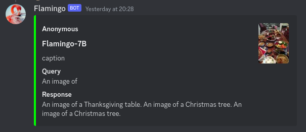
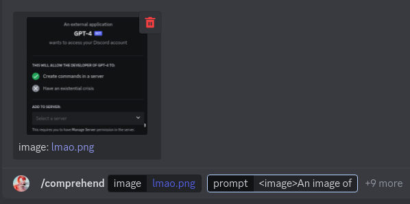

# Flamingo Discord Bot README

## Overview
[OpenFlamingo](https://laion.ai/blog/open-flamingo/) is an experimental 9B multimodal model released by LAION. It is basically LLaMA-7B + ViT-L (CLIP) + some extra cross attention layers, trained on various multimodal datasets.



This is an experimental discord bot built in a day to run that experimental model. **Things will be broken**.

## Prompt philosophy
In Flamingo, training data is designed like this:
```
[example]<|endofchunk|>[example]<|endofchunk|>[...]<|endofchunk|>
```
Where an `[example]` is a string that includes an `<image>` token in it, e.g.
```
<image>Caption: a christmas tree<|endofchunk|>
```
**Prompt** completions are simply accomplished by leaving an unfinished chunk, e.g.
```
<image>Caption: # ... to be completed
```
And **In-context Learning** is achieved by prepending example chunks:
```
<image>Caption: a christmas tree<|endofchunk|><image>Caption: # ... to be completed
```

In designing a discord bot, it makes sense to have a catalogue of registered ICL examples to perform specific tasks, and the [huggingface demo](https://7164d2142d11.ngrok.app/) basically does as much. So, a major design component of this discord bot is the presence of saved **tasks**, which are effectively just lists of ICL examples to prepend to a request.

## Installation
0. if you don't have an RTX 3090 or better, buy that first
1. Follow the installation instructions on the [open_flamingo_inference](https://github.com/152334H/open_flamingo_inference) repo to get OpenFlamingo.
2. `pip install discord.py`
3. fill up `.env` with the following fields (this will change in the future):
    ```env
    MY_GUILD= # server ID ( this will be removed )
    OWNER_ID= # your ID ( this will be removed )
    BOT_TOKEN= # bot token
    LLAMA_PATH= # path to HF llama checkpoint
    ```
4. run `python3 bot.py`

## Commands
### `/comprehend`
This command runs basic inference on 1 image. You must minimally provide:
 * an image file
 * a **prompt** to run, which **contains the** `<image>` **token**.



The `<image>` token represents where the model will "read" your input image.

The other important optional parameter for this command is the **task**. As mentioned earlier, the **task** determines what in-context learning examples are used during inference. The default task is the `caption` task, which instructs the model to provide a short description of the input image.

All other parameters are huggingface generation parameters.

### `/register_task`
tbd

## Limitations
 * The model is under trained and very experimental. It has a clear bias towards extremely short responses as a result of its dataset, even when you attempt to prompt it & adjust inference parameters to be longer.
 * The bot sucks. It has no concept of thread safety, has no permeance of data, is hardcoded to only work on 1 server, and probably some other issues I haven't discovered yet
 * Performance. It's slow, because it's huggingface. It takes up too much vram, because 8bit inference is broken because of an injected mixin
 * Documentation.

## credits
laion, deepmind, gpt4, my boss

## todo
- test transferability of injected layers with alpaca-native & instruct task
- beg the upstream devs to fix 8bit inference
- make the bot less dumb
- fine-tuning ? ?? ? ?

